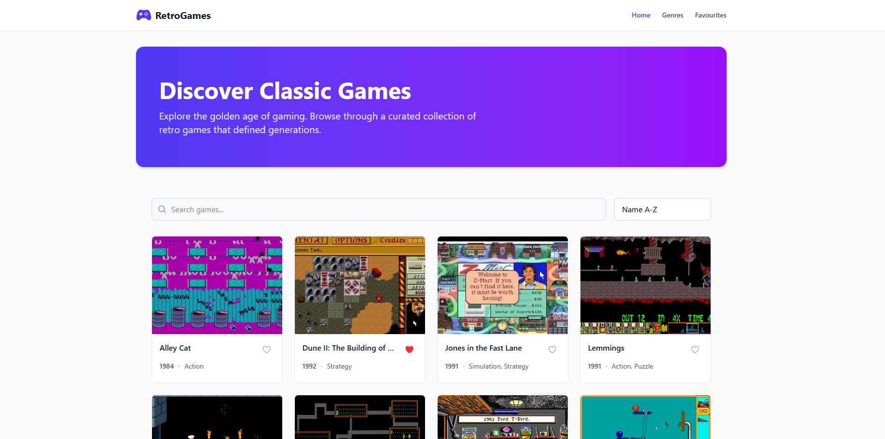

# RetroGames



## 📖 Description

RetroGames is a modern, responsive game discovery web application built for the Noroff JavaScript Frameworks course assignment. It allows users to explore the golden age of gaming by browsing a curated collection of retro games. Users can search for specific titles, sort games alphabetically or by release year, view detailed game information, browse by genre, and save their favourite games to a personal collection.

## Live Demo & Repository

- **Live Site:** [RetroGames Live Site](https://retro-games-tawny.vercel.app/)
- **GitHub Repository:** [retro-games](https://github.com/tedy-abr/retro-games)

## Tech Stack

- **Next.js 16** (App Router)
- **TypeScript**
- **Tailwind CSS v4**
- **React Icons** & **React Hot Toast**

## Main Features

- **Game Discovery:** Browse, search, and sort a curated list of classic games.
- **Dynamic Routing:** View detailed individual game pages and browse categories by genre.
- **Persistent Favourites:** Save games to a personal collection (built with React Context API and `localStorage`).
- **Responsive UI:** Fully responsive design with animated skeleton loading states and robust error handling.

## Getting Started

1. Clone the repository:

   ```bash
   git clone https://github.com/tedy-abr/retro-games.git
   ```

2. Install dependencies:

   ```bash
   npm install
   ```

3. Set up environment variables:
   Create a `.env.local` file in the root directory and add the following:

   ```env
   NEXT_PUBLIC_API_URL=https://v2.api.noroff.dev
   ```

4. Run the development server:

   ```bash
   npm run dev
   ```

5. Open your browser:
   Navigate to [http://localhost:3000](http://localhost:3000)
